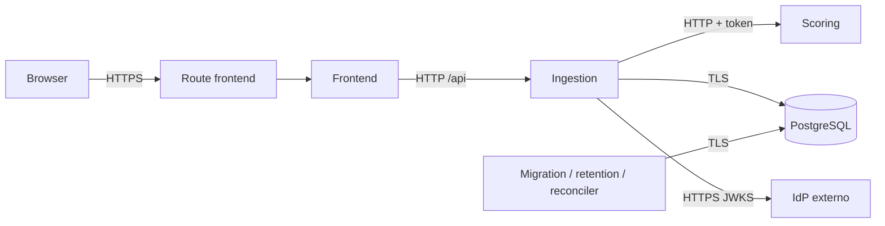

# Despliegue OpenShift — Alternative Credit Scoring

> Generado: 2026-08-10T01:49:55.528Z  
> Commit de aplicación: `4b26afaed87967c3baded18e9cfc46fffa04cf01` — DECLARED  
> Huella de manifiestos: `sha256:d94e3d8c4d5e854dd0193b8a1fdda4ea2060044af8e20c37504f3147d6c31f02` — DECLARED  
> Estados permitidos: `DECLARED`, `OBSERVED`, `PENDING_VALIDATION`.

## Resumen y arquitectura

La única entrada pública es el frontend. Ingestion, scoring, PostgreSQL y los Jobs permanecen internos — DECLARED.



## Contextos y ambientes

| Ambiente | Namespace | Clúster/contexto | Versión | GitOps | Estado | Fuente |
|---|---|---|---|---|---|---|
| dev | rh-ee-mpolo-dev | rh-ee-mpolo-dev/api-rm1-0a51-p1-openshiftapps-com:6443/rh-ee-mpolo | 4.21.21 | Application alternative-credit-scoring-dev | OBSERVED | scripts/platform/discover (sin Secrets) |
| production | production-pending | production-context-pending | PENDING_VALIDATION | Application declarada; reconciliador pendiente | PENDING_VALIDATION | perfil productivo declarativo |

### Capacidades relevantes

| Capacidad | Disponible | Alternativa | Estado |
|---|---|---|---|
| openshift-pipelines | true | approved CI with equivalent gates | OBSERVED |
| openshift-gitops | false | approved GitOps reconciler | OBSERVED |
| external-secrets | true | secure out-of-band provisioning | OBSERVED |
| resource-governance | true | — | OBSERVED |

### Bootstrap namespace-scoped

| Recurso | Estado | Fuente |
|---|---|---|
| serviceaccount/platform-reader | OBSERVED | consulta allowlist posterior a bootstrap |
| serviceaccount/pipeline-build | OBSERVED | consulta allowlist posterior a bootstrap |
| serviceaccount/gitops-reconciler | OBSERVED | consulta allowlist posterior a bootstrap |
| role.rbac.authorization.k8s.io/platform-reader | OBSERVED | consulta allowlist posterior a bootstrap |
| role.rbac.authorization.k8s.io/pipeline-build | OBSERVED | consulta allowlist posterior a bootstrap |
| role.rbac.authorization.k8s.io/gitops-reconciler | OBSERVED | consulta allowlist posterior a bootstrap |
| task.tekton.dev/finance2-build-image | OBSERVED | consulta allowlist posterior a bootstrap |
| task.tekton.dev/finance2-inspect | OBSERVED | consulta allowlist posterior a bootstrap |
| task.tekton.dev/finance2-propose-gitops | OBSERVED | consulta allowlist posterior a bootstrap |
| task.tekton.dev/finance2-publish | OBSERVED | consulta allowlist posterior a bootstrap |
| task.tekton.dev/finance2-render | OBSERVED | consulta allowlist posterior a bootstrap |
| task.tekton.dev/finance2-report | OBSERVED | consulta allowlist posterior a bootstrap |
| task.tekton.dev/finance2-secure | OBSERVED | consulta allowlist posterior a bootstrap |
| task.tekton.dev/finance2-test | OBSERVED | consulta allowlist posterior a bootstrap |
| task.tekton.dev/finance2-verify | OBSERVED | consulta allowlist posterior a bootstrap |
| pipeline.tekton.dev/finance2-release | OBSERVED | consulta allowlist posterior a bootstrap |

## Inventario dev

| Tipo/nombre | Réplicas o ciclo | Imagen por digest | ServiceAccount | Service | ConfigMaps | Secret references | Estado |
|---|---|---|---|---|---|---|---|
| Deployment/frontend | 2 | image-registry.openshift-image-registry.svc:5000/rh-ee-mpolo-dev/frontend@sha256:1111111111111111111111111111111111111111111111111111111111111111 | frontend | frontend | frontend-config | — | DECLARED |
| Deployment/ingestion | 2 | image-registry.openshift-image-registry.svc:5000/rh-ee-mpolo-dev/ingestion@sha256:2222222222222222222222222222222222222222222222222222222222222222 | ingestion | ingestion | ingestion-config | ingestion-runtime, pii-keyring | DECLARED |
| Deployment/scoring | 2 | image-registry.openshift-image-registry.svc:5000/rh-ee-mpolo-dev/scoring@sha256:3333333333333333333333333333333333333333333333333333333333333333 | scoring | scoring | scoring-config | scoring-runtime | DECLARED |
| StatefulSet/postgres | 1 | registry.redhat.io/rhel9/postgresql-16@sha256:b3a61b02f3e9b40160449463eb692e86d8a8386f443b96ac0802f92e50ac87e4 | postgres | postgres | — | — | DECLARED |
| CronJob/postgres-backup | 30 1 * * * | registry.redhat.io/rhel9/postgresql-16@sha256:b3a61b02f3e9b40160449463eb692e86d8a8386f443b96ac0802f92e50ac87e4 | postgres | — | — | backup-target, database-backup | DECLARED |
| CronJob/reconciler | */1 * * * * | image-registry.openshift-image-registry.svc:5000/rh-ee-mpolo-dev/ingestion@sha256:2222222222222222222222222222222222222222222222222222222222222222 | reconciler | — | ingestion-config | database-runtime | DECLARED |
| CronJob/retention | 15 2 * * * | image-registry.openshift-image-registry.svc:5000/rh-ee-mpolo-dev/ingestion@sha256:2222222222222222222222222222222222222222222222222222222222222222 | retention | — | ingestion-config | database-retention | DECLARED |
| Job/migrations | por release | image-registry.openshift-image-registry.svc:5000/rh-ee-mpolo-dev/ingestion@sha256:2222222222222222222222222222222222222222222222222222222222222222 | migrations | — | ingestion-config | database-migrator | DECLARED |
| Job/postgres-restore-test | por release | registry.redhat.io/rhel9/postgresql-16@sha256:b3a61b02f3e9b40160449463eb692e86d8a8386f443b96ac0802f92e50ac87e4 | postgres | — | — | backup-target, database-backup | DECLARED |

### Endpoints dev

| Acceso | URL/host | TLS | Estado |
|---|---|---|---|
| Público: frontend | asignado por ingress tras reconciliación | edge | PENDING_VALIDATION |
| Interno: ingestion | http://ingestion:8080 | aislado por NetworkPolicy | DECLARED |
| Interno: scoring | http://scoring:8080 | aislado por NetworkPolicy | DECLARED |

### Datos y almacenamiento dev

| Recurso | Capacidad/clase | Política de recuperación | Estado |
|---|---|---|---|
| PVC/postgres-data | 5Gi / gp3 | backup cifrado externo + restore-test; PVC no es backup | DECLARED |

### Red autorizada dev

| NetworkPolicy | Flujo | Estado |
|---|---|---|
| allow-cluster-dns | Egress | DECLARED |
| database-from-runtime-and-jobs | Ingress | DECLARED |
| database-jobs-to-postgres | Egress | DECLARED |
| default-deny | Ingress/Egress | DECLARED |
| frontend-to-ingestion | Egress | DECLARED |
| ingestion-from-frontend | Ingress | DECLARED |
| ingestion-to-jwks | Egress | DECLARED |
| ingestion-to-scoring-and-database | Egress | DECLARED |
| postgres-backup-to-target | Egress | DECLARED |
| router-to-frontend | Ingress | DECLARED |
| scoring-from-ingestion | Ingress/Egress | DECLARED |

## Inventario production

| Tipo/nombre | Réplicas o ciclo | Imagen por digest | ServiceAccount | Service | ConfigMaps | Secret references | Estado |
|---|---|---|---|---|---|---|---|
| Deployment/frontend | 2 | registry.production.invalid/alternative-scoring/frontend@sha256:1111111111111111111111111111111111111111111111111111111111111111 | frontend | frontend | frontend-config | — | DECLARED |
| Deployment/ingestion | 2 | registry.production.invalid/alternative-scoring/ingestion@sha256:2222222222222222222222222222222222222222222222222222222222222222 | ingestion | ingestion | ingestion-config | database-tls, ingestion-runtime, pii-keyring | DECLARED |
| Deployment/scoring | 2 | registry.production.invalid/alternative-scoring/scoring@sha256:3333333333333333333333333333333333333333333333333333333333333333 | scoring | scoring | scoring-config | scoring-runtime | DECLARED |
| CronJob/reconciler | */1 * * * * | registry.production.invalid/alternative-scoring/ingestion@sha256:2222222222222222222222222222222222222222222222222222222222222222 | reconciler | — | ingestion-config | database-runtime, database-tls | DECLARED |
| CronJob/retention | 15 2 * * * | registry.production.invalid/alternative-scoring/ingestion@sha256:2222222222222222222222222222222222222222222222222222222222222222 | retention | — | ingestion-config | database-retention, database-tls | DECLARED |
| Job/migrations | por release | registry.production.invalid/alternative-scoring/ingestion@sha256:2222222222222222222222222222222222222222222222222222222222222222 | migrations | — | ingestion-config | database-migrator, database-tls | DECLARED |

### Endpoints production

| Acceso | URL/host | TLS | Estado |
|---|---|---|---|
| Público: frontend | asignado por ingress tras reconciliación | edge | PENDING_VALIDATION |
| Interno: ingestion | http://ingestion:8080 | aislado por NetworkPolicy | DECLARED |
| Interno: scoring | http://scoring:8080 | aislado por NetworkPolicy | DECLARED |

### Datos y almacenamiento production

| Recurso | Capacidad/clase | Política de recuperación | Estado |
|---|---|---|---|
| PostgreSQL externo | sin PVC de aplicación | backup/PITR y restore aislado del proveedor | PENDING_VALIDATION |

### Red autorizada production

| NetworkPolicy | Flujo | Estado |
|---|---|---|
| allow-cluster-dns | Egress | DECLARED |
| database-from-runtime-and-jobs | Ingress | DECLARED |
| database-jobs-to-postgres | Egress | DECLARED |
| default-deny | Ingress/Egress | DECLARED |
| frontend-to-ingestion | Egress | DECLARED |
| ingestion-from-frontend | Ingress | DECLARED |
| ingestion-to-jwks | Egress | DECLARED |
| ingestion-to-scoring-and-database | Egress | DECLARED |
| router-to-frontend | Ingress | DECLARED |
| runtime-and-jobs-to-external-database | Egress | DECLARED |
| scoring-from-ingestion | Ingress/Egress | DECLARED |

## Identidades, configuración y secretos

Las ServiceAccounts de workloads no reciben token automático ni RBAC Kubernetes. `platform-reader`, `pipeline-build` y `gitops-reconciler` son identidades separadas con permisos acotados — DECLARED.

Los nombres `ingestion-runtime`, `scoring-runtime`, `database-migrator`, `database-retention`, `database-runtime`, `database-tls`, `pii-keyring`, `database-backup`, `backup-target`, `registry-push` y `gitops-repository` son referencias; este documento nunca contiene sus valores — DECLARED.

## CI, GitOps y promoción

PR: inspect → test → secure → render. Merge: build secuencial una sola vez → publish por digest → PR GitOps → reconcile → migration PreSync → rollout → smoke → report — DECLARED.
Repositorio de aplicación: https://github.com/red-hat-nella/finance.git — DECLARED. Repositorio de estado deseado y rama protegida: PENDING_VALIDATION.
Rollback ordinario: revertir por PR el digest/configuración a una revisión saludable; nunca aplicar directamente. Los esquemas deben ser compatibles N/N-1; restaurar datos es recuperación, no rollback — DECLARED.

## Observabilidad

Endpoints `/metrics` internos para ingestion y scoring; logs JSON con redacción. Alertas mínimas: disponibilidad del frontend, DB, tasa/latencia de scoring, migración, retención, reconciliador, recuperación PostgreSQL y salud GitOps — DECLARED.
Dashboards y recursos ServiceMonitor/PrometheusRule: PENDING_VALIDATION hasta descubrir una integración aprobada.

## Procedimientos seguros

```bash
oc project rh-ee-mpolo-dev
scripts/platform/discover --context current --namespace rh-ee-mpolo-dev --output build/platform/dev-profile.json
scripts/platform/render --all --output-dir build/rendered
scripts/platform/validate --all --cluster-version 4.21.21 --evidence-dir build/platform/evidence/static
oc -n rh-ee-mpolo-dev get deployments,statefulsets,jobs,cronjobs,pods,services,routes,pvc
oc -n rh-ee-mpolo-dev get events --sort-by=.lastTimestamp
oc -n rh-ee-mpolo-dev logs deployment/ingestion --since=15m
scripts/platform/smoke --environment dev --namespace rh-ee-mpolo-dev --fixture tests/fixtures/medium-risk-application.json --evidence build/platform/evidence/dev/smoke.json
scripts/platform/verify-backup-restore --environment dev --restore-target isolated --evidence build/platform/evidence/dev/restore.json
scripts/platform/rollback --environment dev --to-release HEALTHY_RELEASE --propose-only
```
Ningún procedimiento consulta objetos Secret ni imprime credenciales — DECLARED.

## Estado de última verificación

Render, pruebas, imágenes, SBOM y políticas: DECLARED por `build/platform/evidence/static-validation.json`. Bootstrap namespace-scoped: OBSERVED por `build/platform/evidence/bootstrap-observed.json`. Reconciliación, pods observados, Route asignada, persistencia y smoke: PENDING_VALIDATION en `build/platform/evidence/dev-release.json`; promoción/rollback productivo: PENDING_VALIDATION en `build/platform/evidence/production-release.json`.
Los pods se identifican por su controlador y réplicas deseadas; los nombres efímeros nunca son identidad operativa estable — DECLARED.

## PLATFORM_INPUT_REQUIRED

| Dato indispensable | Motivo | Responsable/canal seguro | Estado |
|---|---|---|---|
| Controlador GitOps aprobado, repositorio de estado deseado y rama protegida | la API argoproj.io no fue confirmada | administrador de plataforma; registrar identificadores no sensibles | PENDING_VALIDATION |
| Referencias OIDC, DB productiva, backup y registro | son servicios controlados por la organización | propietarios de identidad/datos por vault o canal corporativo; solo nombres aquí | PENDING_VALIDATION |
| Destino, dominio/CIDR/TLS y aprobación productiva | determinan conectividad y liberación regulada | plataforma/seguridad/cambio; ticket o catálogo aprobado | PENDING_VALIDATION |

## Procedencia

`DECLARED`: manifiestos renderizados y contratos versionados. `OBSERVED`: perfil sanitizado obtenido mediante consultas allowlist de solo lectura. `PENDING_VALIDATION`: dato dinámico o externo aún no demostrado.
